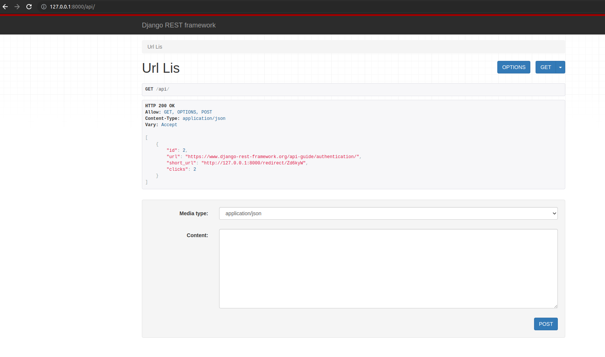
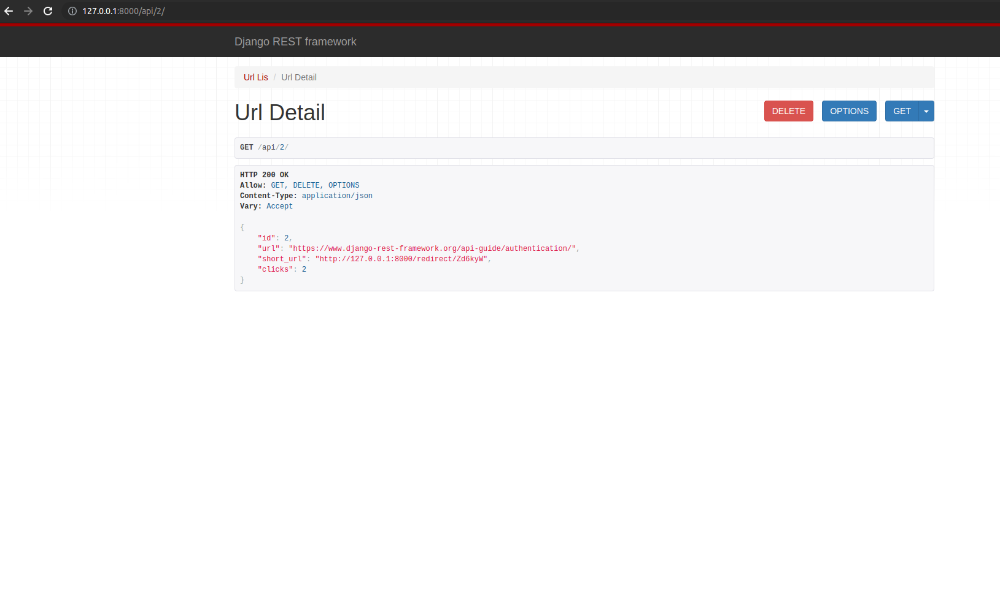

# URL-shortening-service

This Django project implement an API for URL shortening service. This project allows you to shorten any url and get statistics of click on it.

## Installation

Python must be already installed

```shell
git clone https://github.com/Igor-Cegelnyk/URL-shortening-service.git
cd URL-shortening-service/
python3 -m venv venv
source venv/bin/activate (on macOS/Linux) #source venv/Scripts/activate (on Windows)
pip install -r requirements.txt
python manage.py migrate
python manage.py ranserver  # starts Django Server
```

## Features

* Shortening url in one click
* Get static for click on short url
* The use of the service is anonymous with a save own url.

## Demo


